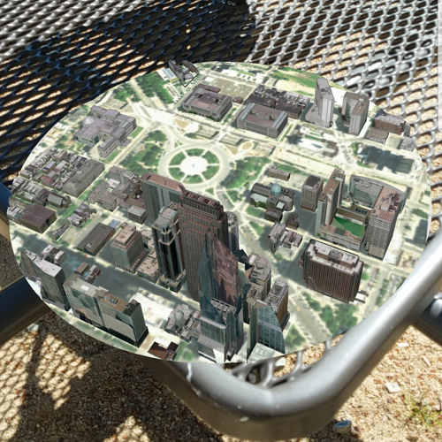

# Display scenes in tabletop AR

Use augmented reality (AR) to pin a scene to a table or desk for easy exploration.

## Use case

Tabletop scenes allow you to use your device to interact with scenes as if they are 3D-printed model models sitting on your desk. You could use this to virtually explore a proposed development without needing to create a physical model.

## How to use the sample

You'll see a feed from the camera when you open the sample. Tap on any flat, horizontal surface (like a desk or table) to place the scene. With the scene placed, you can move the camera around the scene to explore. You can also pan and zoom with touch to adjust the position of the scene.

## How it works

1. Create an `ArcGISArView` and add it to the view.
    * Note: this sample uses content in the WGS 84 geographic tiling scheme, rather than the web mercator tiling scheme. Once a scene has been displayed, the scene view cannot display another scene with a non-matching tiling scheme. To avoid that, the sample starts by showing a blank scene with an invisible base surface. Touch events will not be raised for the scene view unless a scene is displayed.
2. Wait for the user to tap the view, then use `ArcGISArView::setInitialTransformation(tappedPoint)` to set the initial transformation, which allows you to place the scene. This method uses ARKit's built-in plane detection.
3. To enable looking at the scene from below, set `scene::baseSurface::setNavigationConstraint` to `NavigationConstraint::None`.
4. Set the clipping distance property of the AR view. This will clip the scene to the area you want to show.
5. Set the origin camera to the point in the scene where it should be anchored to the real-world surface you tapped. Typically that is the point at the center of the scene, with the altitude of the lowest point in the scene.
6. Set `ArcGISArView::translationFactor` such that the user can view the entire scene by moving the device around it. The translation factor defines how far the virtual camera moves when the physical camera moves.
    * A good formula for determining translation factor to use in a tabletop map experience is **translationFactor = sceneWidth / tableTopWidth**. The scene width is the width/length of the scene content you wish to display in meters. The tabletop width is the length of the area on the physical surface that you want the scene content to fill. For simplicity, the sample assumes a scene width of 800 meters and physical size of 1 meter.

## Relevant API

* ArcGISArView
* Surface

## Offline data

Read more about how to set up the sample's offline data [here](http://links.esri.com/ArcGISRuntimeQtSamples).

Link | Local Location
---------|-------|
|[Philadelphia MSPK](https://www.arcgis.com/home/item.html?id=7dd2f97bb007466ea939160d0de96a9d)| `<userhome>`/ArcGIS/Runtime/Data/mspk/philadelphia.mspk |

## About the data

This sample uses the [Philadelphia Mobile Scene Package](https://www.arcgis.com/home/item.html?id=7dd2f97bb007466ea939160d0de96a9d). It was chosen because it is a compact scene ideal for tabletop use. Note that tabletop mapping experiences work best with small, focused scenes. The small, focused area with basemap tiles defines a clear boundary for the scene.

## Additional information

1. Clone the [ArcGIS Runtime Toolkit](https://github.com/Esri/arcgis-runtime-toolkit-qt) repository.
2. In the project's `.pro` file, make sure to set the path, `AR_TOOLKIT_SOURCE_PATH`, to the ArcGIS Toolkit source folder you just cloned.
3. The sample contains the necessary changes to deploy to iOS or Android as is.

Note: Filesystem permissions is required for this sample.

For more information on the Augmented Reality (AR) toolkit see [the AR README on GitHub](https://github.com/Esri/arcgis-runtime-toolkit-qt/blob/master/Common/AR/README.md#augmented-reality-toolkit-components).

## Tags

augmented reality, drop, mixed reality, model, pin, place, table-top, tabletop
