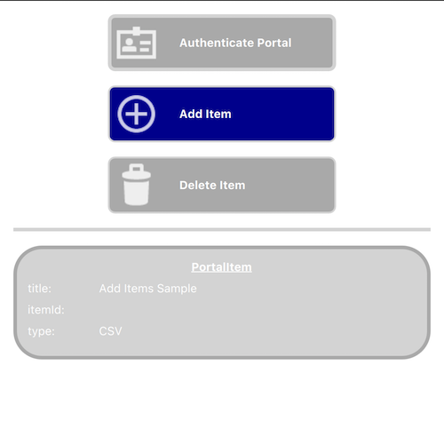

# Add items to portal

This sample demonstrates how to add and delete items in a user's portal.

## Use case

Portals allow you to share and publish data with others. For example, you may create or collect some data on your device and want to upload that to a cloud storage location to share with others or simply save for later use. In this case, a CSV file is created and uploaded to ArcGIS Online.

## How to use the sample

1. Press the Authenticate Portal button and sign into your ArcGIS Online account.
2. Press the Add Item button, and this will add the CSV to your `Portal`.
3. Press the Delete Item button, and this will delete that same item from your `Portal`.

## How it works

1. A `Portal` is created with a `Credential` using `OAuthModeUser`. The `Portal` instance is loaded and the OAuth sign in page is displayed. The user must now provide credentials.
2. Once the sign-in process is complete, a `PortalItem` of type `CSV` is created using this `Portal` instance.
3. When the portal is successfully loaded, the `PortalUser` object is obtained from the `Portal`.
5. When the "Add Item" button is clicked, the item is added via the `PortalUser`'s `addPortalItemWithUrl` method. The `PortalItem` and the local URL of the CSV file are supplied as parameters.
6. When the item has been successfully added, it is loaded in order to retrieve online properties such as the `itemId`.'
7. When the "Delete Item" button is clicked, the item is passed as a parameter for the portalUser's `deleteItem` method.

## Relevant API

* Portal
* PortalItem
* PortalUser::addPortalItemWithUrl
* PortalUser::deleteItem

## Tags

add item, cloud, portal
