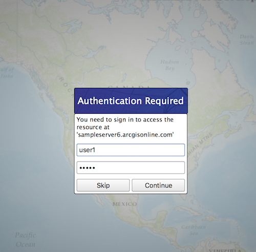

#Token authentication

This sample demonstrates how to access a map service that is secured with ArcGIS token-based authentication.

##How it works

A map service that is secured with ArcGIS token-based authentication is added to the map's operational layers. Next, the `AuthenticationView` component from the ArcGIS Runtime Toolkit is added to the QML layout, and its `authenticationManager` property is set to the `AuthenticationManager` singleton. The `AuthenticationView` handles all of the authentication challenges that are issued, automatically displays the appropriate view, and continues the challenge with the user provided credential. In order to access the `AuthenticationManager` from the QML side, it must first be registered as a QML type, and then exposed as a Q_PROPERTY. When the map loads and attempts to load the secured map service, a challenge is issued, the `UserCredentialsView` is automatically displayed by the `AuthenticationView`, and the user can then provide the username and password for this resource. In this case, the username is `user1` and the password is also `user1`.

##Features
- AuthenticationManager
- AuthenticationChallenge
- AuthenticationView
- Map
- MapView
- ArcGISMapImageLayer
