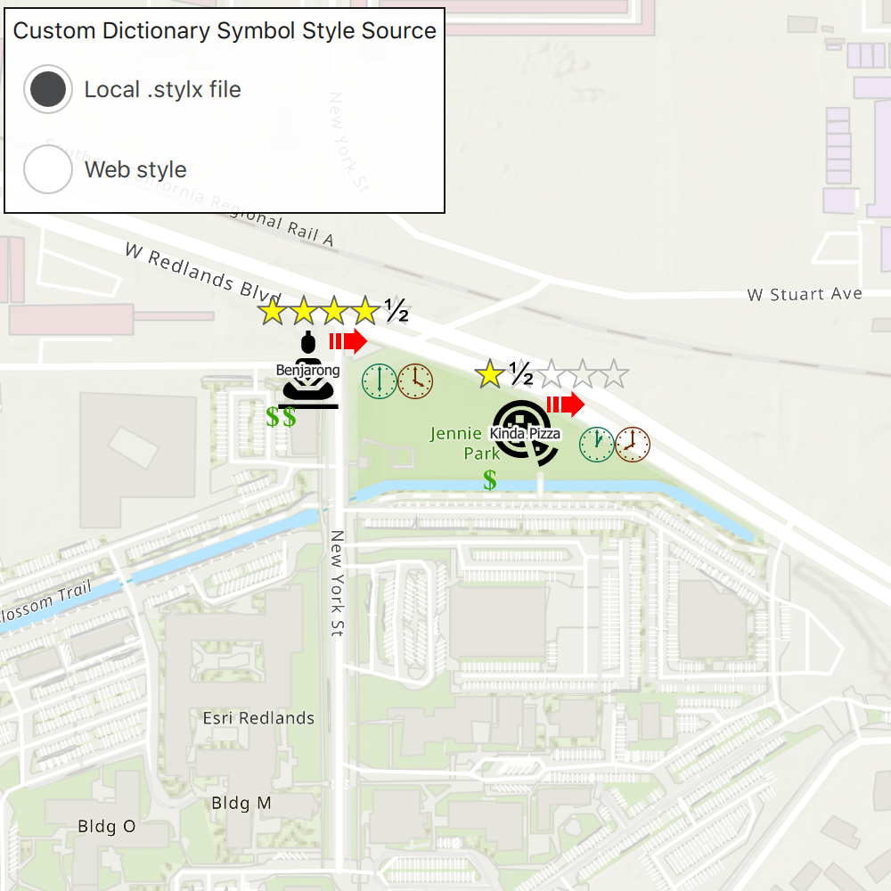

# Custom dictionary style

Use a custom dictionary created from a web style or style file (.stylx) to symbolize features using a variety of attribute values.

## Use case

When symbolizing geoelements in your map, you may need to convey several pieces of information with a single symbol. You could try to symbolize such data using a unique value renderer, but as the number of fields and values increases, that approach becomes impractical. With a dictionary renderer you can build each symbol on-the-fly, driven by one or more attribute values, and handle a nearly infinite number of unique combinations.

## How to use the sample

Toggle between the dictionary symbols from the local .stylx file and the web style. Pan and zoom around the map to see the symbology from the chosen dictionary symbol style.

## How it works

1. Create a new `FeatureLayer` and append it to the Map's operational layers.
2. Use `DictionarySymbolStyle::createFromFile()` to create a `DictionarySymbolStyle` from a .stylx file.
3. Create a `DictionarySymbolStyle` from a `PortalItem`
    * Load the web `DictionarySymbolStyle`
    * Remap any inconsistent fields between the `FeatureLayer` and the `DictionarySymbolStyle`
4. Create a `DictionaryRenderer` for each `DictionarySymbolStyle`s.
5. Apply the desired `DictionaryRenderer` to render the `FeatureLayer`'s `Feature`s with the respective `DictionarySymbolStyle`s.

## Relevant API

* DictionaryRenderer
* DictionarySymbolStyle
* PortalItem

## About the data

The data used in this sample is from a feature layer showing a subset of [restaurants in Redlands, CA](https://services2.arcgis.com/ZQgQTuoyBrtmoGdP/arcgis/rest/services/Redlands_Restaurants/FeatureServer) hosted as a feature service with attributes for rating, style, health score, and open hours.

## Additional information

For information about creating your own custom dictionary style, see the open source [dictionary-renderer-toolkit](https://esriurl.com/DictionaryToolkit).

## Tags

dictionary, renderer, style, stylx, unique value, visualization
