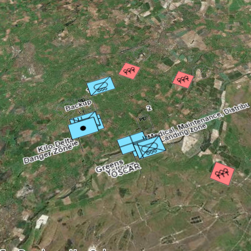

#Graphics overlay (dictionary renderer) 3D

This sample demonstrates applying a dictionary renderer to graphics, in order to display military symbology without the need for a feature layer.

##How it works

The sample loads a number of point military elements from an XML file and adds them as graphics to a `GraphicsOverlay`. A `DictionaryRenderer` is applied to the `GraphicsOverlay` in order to display the graphics with MIL-STD-2525D military symbology. The `GraphicsOverlay`'s `renderingMode` parameter is set to `GraphicsRenderingMode::Dynamic`, so that point features are displayed with billboarded symbols facing the user (a developer can set `renderingMode` to `GraphicsRenderingMode::Static` if desired to instead drape the symbols on the surface). When all graphics are created, the 3D scene's viewpoint is set to zoom to the full extent of all graphics.

##Features
- ArcGISTiledElevationSource
- Basemap
- Camera
- DictionaryRenderer
- Envelope
- Geometry
- GeometryEngine
- Graphic
- GraphicsOverlay
- Point
- Scene
- SceneQuickView
- SceneView
- SpatialReference
- Surface
- SymbolDictionary

##Offline Data
Read more about how to set up the sample's offline data [here](http://links.esri.com/ArcGISRuntimeQtSamples).

Link | Local Location
---------|-------|
|[Mil2525d Stylx File](https://www.arcgis.com/home/item.html?id=4581a9a92c214240a79e15482a2e8349)| `<userhome>`/ArcGIS/Runtime/Data/styles/mil2525d.stylx |
|[MIL-STD-2525D XML Message File](https://www.arcgis.com/home/item.html?id=623382e0113d40698538f249e3bcb1c0)| `<userhome>`/ArcGIS/Runtime/Data/xml/Mil2525DMessages.xml |
