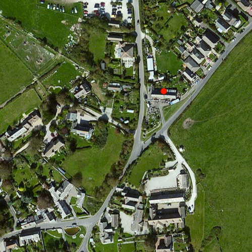

# Simple marker symbol

This sample demonstrates how to add a point graphic, symbolized by a red
circle specified via a `SimpleMarkerSymbol`, to a `GraphicsOverlay`.

## How it works

A `Graphic` sets a `Point` geometry and a red circle
`SimpleMarkerSymbol`. That `Graphic` is added to a `GraphicsOverlay`
which is added to the `MapView`.
