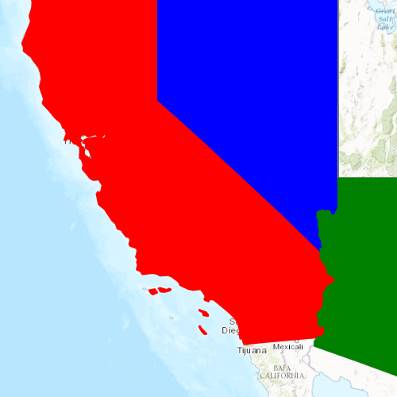

# Unique value renderer

This sample demonstrates how to use a `UniqueValueRenderer` to style different Features in a `FeatureLayer` with different Symbols.

## How it works
This sample demonstrates how to use a `UniqueValueRenderer` to style different features in a `FeatureLayer`. Using the `UniqueValueRenderer` allows for separate symbols to be used for features that have a specific value in a certain field. In this case, the field is state abbreviations in the USA. Multiple fields can be used; this sample only uses one:

1. Multiple `SimpleFillSymbols`s are defined for each type of feature we want to render differently.
2. `SimpleFillSymbol`s can be applied to polygon features, which is the type of feature used for this `ServiceFeatureTable`.
3. Separate `UniqueValue`s objects are created which define the values in the renderer field and what symbol should be used to render matching features.
4. A default symbol is created to render all features that do not match the `UniqueValue`s defined.

## Features
- Map
- MapView
- Basemap
- ServiceFeatureTable
- FeatureLayer
- UniqueValueRenderer
- SimpleFillSymbol
- SimpleLineSymbol
- Viewpoint
- Envelope
- SpatialReference
