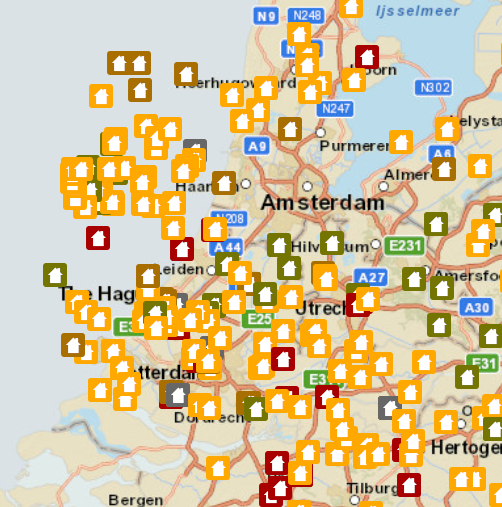

# Add features (feature service)

Add features to a feature layer.

## Use case

An end-user performing a survey may want to add features to the map during the course of their work.

## How to use the sample

Click on a location on the map to add a feature at that location.

## How it works

A `Feature` is added to a `ServiceFeatureTable` which then pushes that new feature to the server.

1. Create a `ServiceFeatureTable` from a URL.
2. Create a `FeatureLayer` from the service feature table.
3. Create a `Feature` with attributes and a location using `createFeature()`.
4. Add the feature to the table.
5. Update the table on the server using `applyEdits()`.

## Relevant API

* Feature
* FeatureEditResult
* FeatureLayer
* ServiceFeatureTable

## Tags

edit, feature, online service
