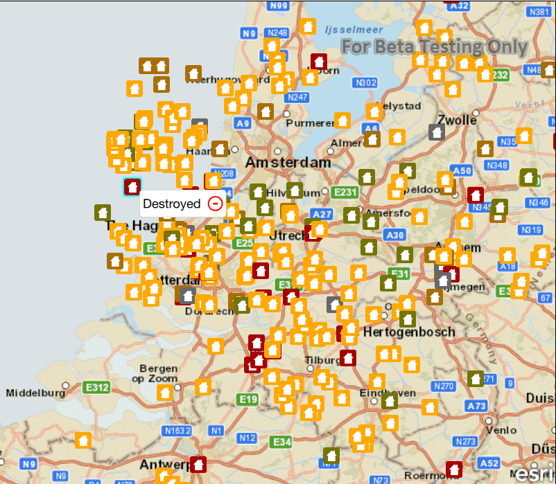

#Delete features feature service

This sample demonstrates how to delete a feature from a feature service.

##How it works

Clicking or tapping on a feature displays a callout for it. To delete that feature from the feature service, select the `delete` button in the callout. This button will invoke the `deleteFeature` method on the feature table, deleting the feature from the local table. Then the `applyEdits` method is called to apply the edits to the service, deleting the feature from the service.

##Features
- MapView
- Map
- Basemap
- Viewpoint
- SpatialReference
- ServiceFeatureTable
- FeatureLayer
- Feature
- ArcGISFeature
- FeatureEditResult
- FeatureQueryResult