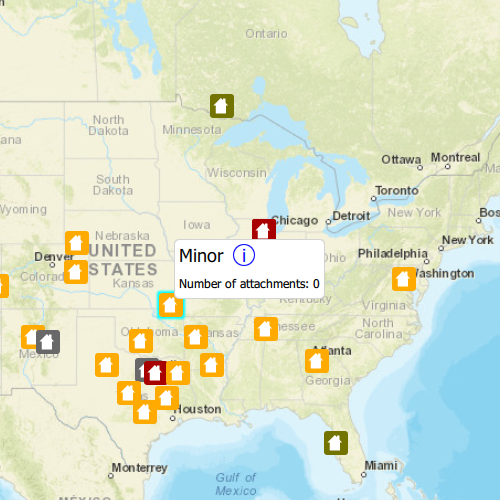

# Edit feature attachments

Add, delete, and download attachments for features from a service.

## Use case

Attachments provide a flexible way to manage additional information that is related to your features. Attachments allow you to add files to individual features, including: PDFs, text documents, or any other type of file. For example, if you have a feature representing a building, you could use attachments to add multiple photographs of the building taken from several angles, along with PDF files containing the building's deed and tax information.

## How to use the sample

Tap a feature on the map to open a callout displaying the number of attachments. Tap on the info button to view/edit the attachments. Select an entry from the list to download and view the attachment in the gallery. Tap on the floating action button '+' or '-' too add or remove an attachment.

## How it works

1. Create a `ServiceFeatureTable` from a URL.
2. Create a `FeatureLayer` object from the service feature table.
3. Select features from the feature layer with `selectFeatures`.
4. To fetch the feature's attachments, cast to an `ArcGISFeature` and use`ArcGISFeature::attachments()`.
5. To add an attachment to the selected ArcGISFeature, create an attachment and use `ArcGISFeature::attachments()::addAttachment()`.
6. To delete an attachment from the selected ArcGISFeature, use the `ArcGISFeature.deleteAttachment()`.
7. By default, edits are automatically applied to the service and `applyEdits` does not need to be called.

## Additional information

Attachments can only be added to and accessed on service feature tables when their hasAttachments property is true.

## Relevant API

* ApplyEdits
* AttachmentListModel
* DeleteAttachment
* FeatureLayer
* FetchAttachments
* FetchData
* ServiceFeatureTable
* UpdateFeature

## Tags

Edit and Manage Data, image, picture, JPEG, PNG, PDF, TXT
