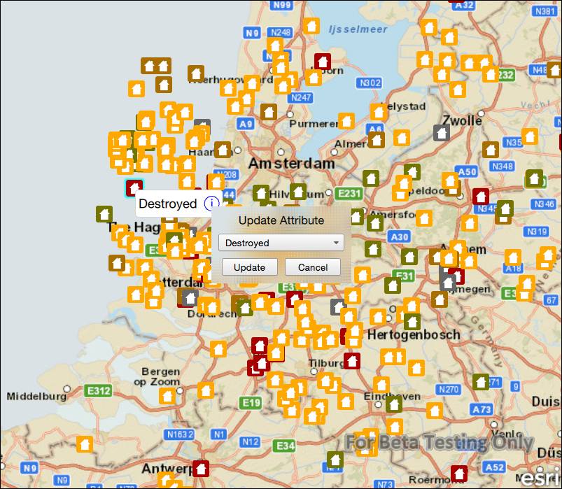

#Update attributes feature service

This sample demonstrates how to edit attributes of a feature in a feature service.

##How it works

Features in the map represent properties and are symbolized based on the type of damage to the property. Tapping on a feature displays a callout. The callout contains information about the type of damage on that property. In order to change the type of damage, tap on the information button in the callout. An editing window will appear that allows for different values to be selected. Clicking update will update the feature with the new value. This is done by first obtaining the feature after it is selected. Once the feature is obtained, the feature attribute is updated by calling the `setAttributeValue` method. To update the feature in the feature table, call `updateFeature`, and pass in the edited feature. Finally, to update the service, call the `applyEdits` method, and this will apply the feature edits to the service.

##Features
- MapView
- Map
- Basemap
- Viewpoint
- SpatialReference
- ServiceFeatureTable
- FeatureLayer
- Feature
- ArcGISFeature
- FeatureEditResult
- FeatureQueryResult
- Point