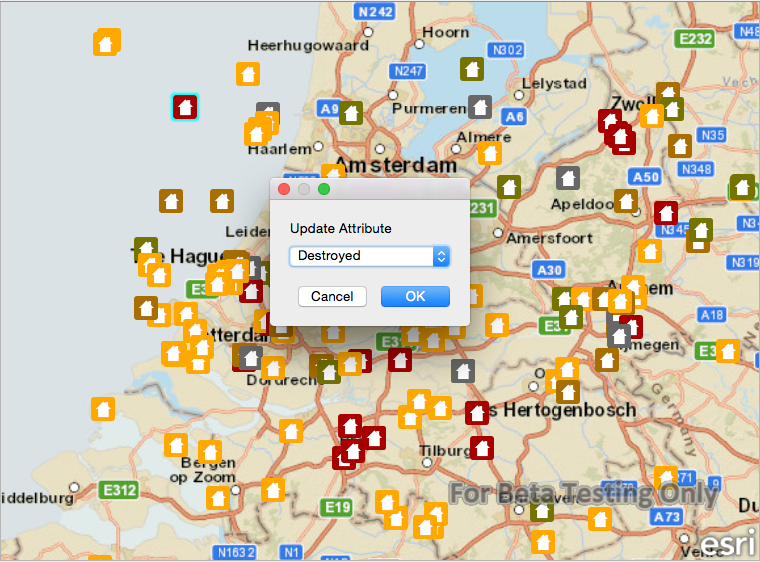

#Update attributes (feature service)

This sample demonstrates how to update attributes of a feature in a feature service.

##How it works

This sample calls identify on the MapView in order to obtain features from the touch event. Once a feature is selected, its attributes are updated by calling setAttributeValue, and passing in the field name and the new value. To update the feature in the feature table, call updateFeature and pass in the feature with the edited attributes. The updateFeatureCompleted signal fires once this completes. Finally, the edits are applied to the feature service by calling the applyEdits method on the ServiceFeatureTable.

##Features
- MapView
- Map
- Basemap
- ServiceFeatureTable
- FeatureLayer
- Feature