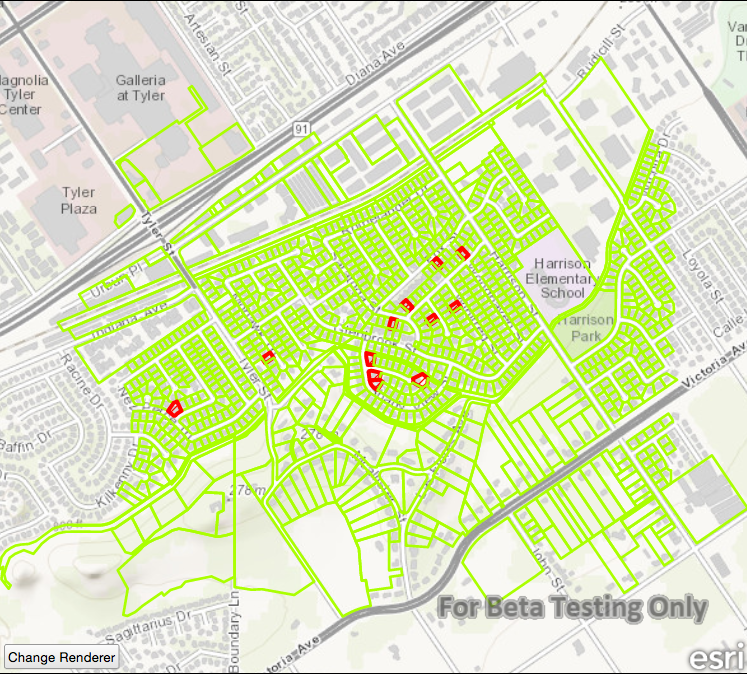

# Feature layer change renderer

This sample demonstrates how to override and reset a feature layer renderer.

## How it works

A `SimpleRenderer` is created with a `SimpleLineSymbol`. When the button is clicked, it calls an invokable C++ function that calls `setRenderer` on the `FeatureLayer`, and passes in the new `SimpleRenderer`.

## Features
- MapView
- Map
- Basemap
- Viewpoint
- SpatialReference
- ServiceFeatureTable
- FeatureLayer
- Envelope
- SimpleLineSymbol
- SimpleRenderer
