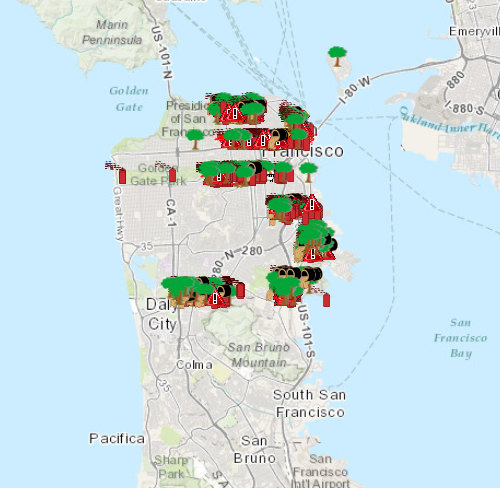

# Feature layer definition expression

This sample demonstrates how to limit the features to display on the map using a definition expression.

## How it works

Clicking the button calls an invokable C++ function that calls `setDefinitionExpression` on the `FeatureLayer`. This takes in a where clause, and filters the view based on features that satisfy the specified condition.

## Features
- MapView
- Map
- Basemap
- Viewpoint
- SpatialReference
- ServiceFeatureTable
- FeatureLayer
- Point
