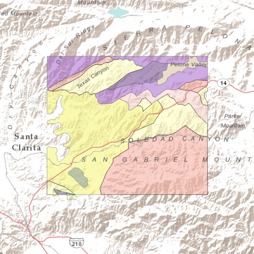

# Feature layer (feature service)

This sample demonstrates how to consume an Esri feature service by using
a FeatureLayer and a ServiceFeatureTable.

## How it works

The sample creates an instance of ServiceFeatureTable by supplying the
URL to the REST endpoint of the feature service. The FeatureLayer is
then supplied with the ServiceFeatureTable and added to the Map.
