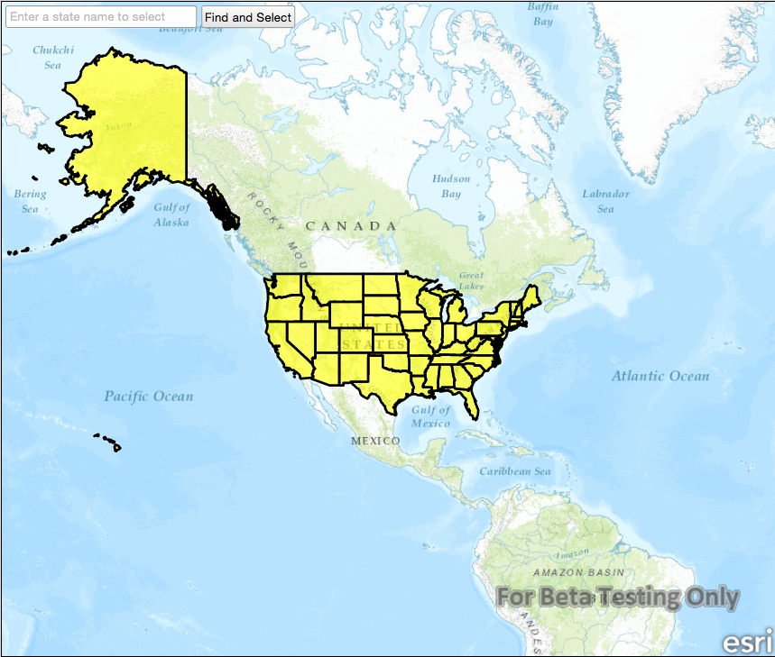

#Feature layer query

This sample demonstrates how to query a feature layer using a feature table.

##How it works

Enter a state name in the textbox and hit enter or press the Find and Select button. This will call an invokable C++ function that will call `queryFeatures` on the `ServiceFeatureTable`. If a feature is returned from the signal, the feature will be selected and highlighted on the mapview.

##Features
- MapView
- Map
- Basemap
- Viewpoint
- SpatialReference
- ServiceFeatureTable
- FeatureLayer
- Viewpoint