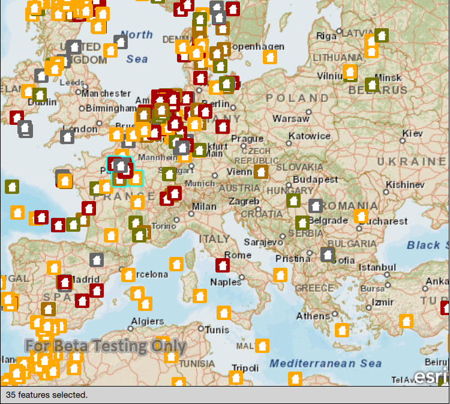

#Feature layer selection

This sample demonstrates how to select features in a feature layer.

##How it works

Click or tap on an area of the map where you see features to select features. This will execute an `identifyLayer` operation on the map view. When the operation completes, the `identifyLayerCompleted` signal emits, and a list of features is returned. Call the `selectFeatures` method on the feature layer, passing in the list of features. This will select the features and highlight them on the map view.

##Features
- MapQuickView
- Map
- Basemap
- Viewpoint
- SpatialReference
- ServiceFeatureTable
- FeatureLayer
- Feature
- Envelope
- GeoElement

