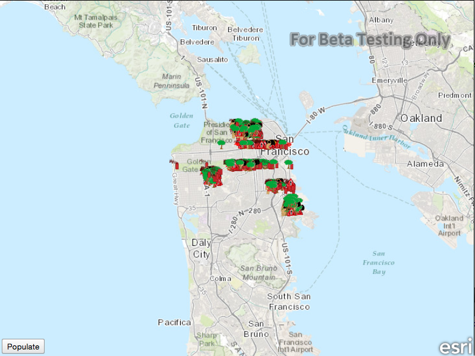

#Service feature table - manual cache

This sample demonstrates how to use a feature service in manual cache mode. 
In this mode, an app explicitly requests features as needed from the remote service. 

##How it works

The sample creates a service feature table by supplying the URL to the REST 
endpoint of the feature service, and set the caching mode to manual. It 
creates a new feature layer that uses the service feature table, and adds the 
feature layer to the map. When the `Populate` button is pressed, the sample 
calls the `populateFromService` method on the feature layer to fetch new 
features from the service, which are automatically added to the map. 

##Features
- MapView
- Map
- Basemap
- ServiceFeatureTable
- FeatureLayer
- QueryParameters