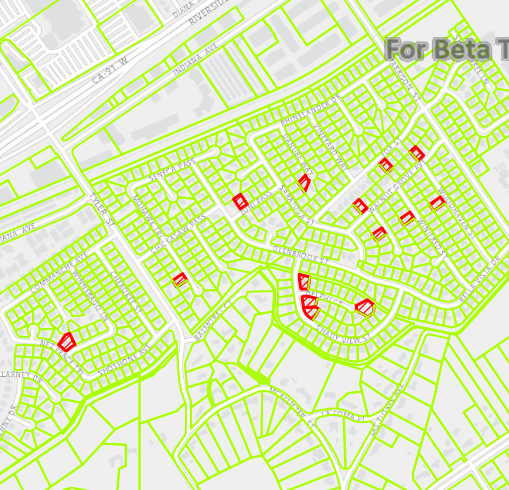

# Service feature table (no cache)

Display a feature layer from a service using the **no cache** feature request mode.

## Use case

`ServiceFeatureTable` supports three request modes, which define how features are requested from the service and stored in the local table. The feature request modes have different performance characteristics. Use **no cache** in scenarios where you always want the freshest data. See [Table performance concepts](https://developers.arcgis.com/qt/latest/cpp/guide/layers.htm#ESRI_SECTION1_40F10593308A4718971C9A8F5FB9EC7D) to learn more.

## How to use the sample

Run the sample and pan and zoom around the map. With each interaction, new features will be requested from the service and displayed on the map.

## How it works

1. Set the `ServiceFeatureTable::setFeatureRequestMode` property of the service feature table to `FeatureRequestMode::OnInteractionNoCache` before the table is loaded.
2. Add the table to the map using a `FeatureLayer`.

## Relevant API

* FeatureLayer
* FeatureRequestMode::OnInteractionNoCache
* ServiceFeatureTable
* ServiceFeatureTable::populateFromService
* ServiceFeatureTable::setFeatureRequestMode

## About the data

This sample displays a [Pool permit](https://sampleserver6.arcgisonline.com/arcgis/rest/services/PoolPermits/FeatureServer/0) feature layer in Riverside, California, displaying which parcels do not have pool permits.

## Additional information

In **no cache** mode, features are automatically populated from the service for the visible extent. Each time the user pans and zooms, features are downloaded for the visible extent. Features are still cached in a local geodatabase for display, but the cache will always be populated with the latest data after navigation.

> **NOTE**: **No cache** does not guarantee that features won't be cached locally; feature request mode is a performance concept unrelated to data security.

## Tags

cache, feature request mode, performance
