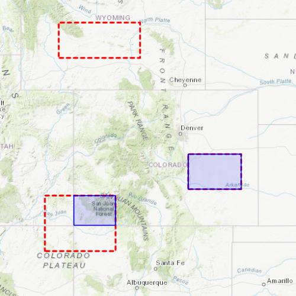

# Clip geometry

This sample demonstrates how to clip a geometry with an envelope using the GeometryEngine.

## How to use the sample
Click or tap the 'Clip' button to display the clipping results of the blue graphic and the red outlines.

## How it works
1. Create at least three  `graphicsOverlays`, one with a reference graphic, one (or more) with an overlapping envelope-based graphic, and one empty one to contain the result
2. Add each `graphicsOverlay` to the `mapView`
3. Create a variable that stores the result of the static function `GeometryEngine::clip`, which accepts a reference `Geometry` and an `Envelope`
4. Create a graphic using the clip variable as the geometry argument and append it to the empty `graphicsOverlay`

## Relevant API
 - GeometryEngine::clip()
 - GraphicsOverlay
 - Graphic
 - Geometry
 - Envelope

## Tags
Geometry, clip, 2D, map, graphics

