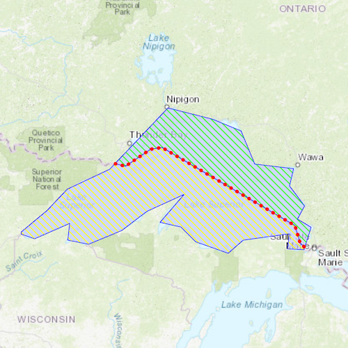

# Cut geometry

Cut a geometry along a polyline.

## Use case

You might cut a polygon representing a large parcel to subdivide it into smaller parcels.

## How to use the sample

Click "Cut" to cut the polygon with the polyline and see the resulting parts (shaded in different colors).

## How it works

1. Pass the geometry and polyline to `GeometryEngine::cut` to cut the geometry along the polyline.
2. Create a new `Graphic` for each in the list of cut geometries and add them to the `GraphicsOverlay` on the `MapView`.

## Relevant API

* GeometryEngine::cut
* Polygon
* Polyline

## Tags

cut, geometry, split
