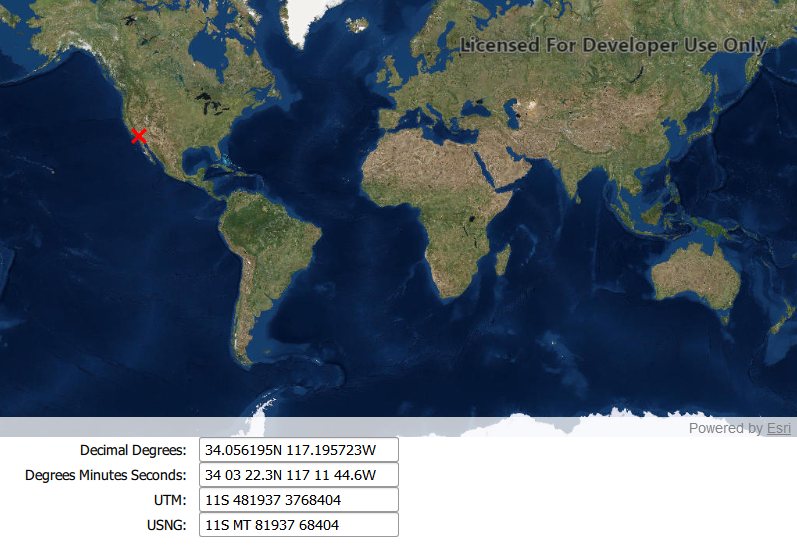

# Format coordinates (URL)

Coordinates can be written and formatted in different ways, for example latitude, longitude coordinates can be formatted as decimal degrees, or degrees, minutes, and seconds. This sample demonstrates how to convert a map location `Point` in WGS 1984 spatial reference to a number of different coordinate notations (decimal degrees; degrees, minutes, seconds; Universal Transverse Mercator (UTM), and United States National Grid (USNG)), by using `CoordinateFormatter`. 

The `CoordinateFormatter` also supports Military Grid Reference System (MGRS), Global Area Reference System (GARS), and World Geographic Reference System (GEOREF) notations, using similar methods to those shown in this sample app.

## How it works

Click or tap on the map to indicate a location that will be formatted into each of the four formats demonstrated. Additionally, coodinate notation strings can be converted to a `Point` and shown in the map by clicking or tapping on the notation values shown and entering a coordinate in the appropriate notation.

## Features
- CoordinateFormatter
- Point
- Graphic
