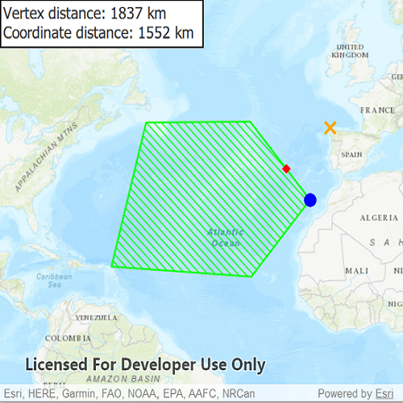

# Nearest vertex
Get the vertex of a geometry closest to a point.

## How to use the sample
Tap anywhere on the map. An orange marker will show at that tapped location. A blue marker will show the polygon's nearest vertex to the tapped location. A red marker will show the nearest coordinate within the polygon geometry. A label will display the distance from the tapped location to the nearest vertex and nearest coordinate.

## How it works
1. Get a `Point` to check the nearest vertex against.
2. Call `GeometryEngine::nearestVertex(inputGeometry, point)`. The returned `ProximityResult` can be used to get the `coordinate` and distance between the vertex and point.
3. Call `GeometryEngine::nearestCoordinate(inputGeometry, point)`. The returned `ProximityResult` can be used to get the `coordinate` and distance between the coordinate and point.

## Relevant API
 - GeometryEngine
 - ProximityResult

## Tags
geometry, polygon, proximity

