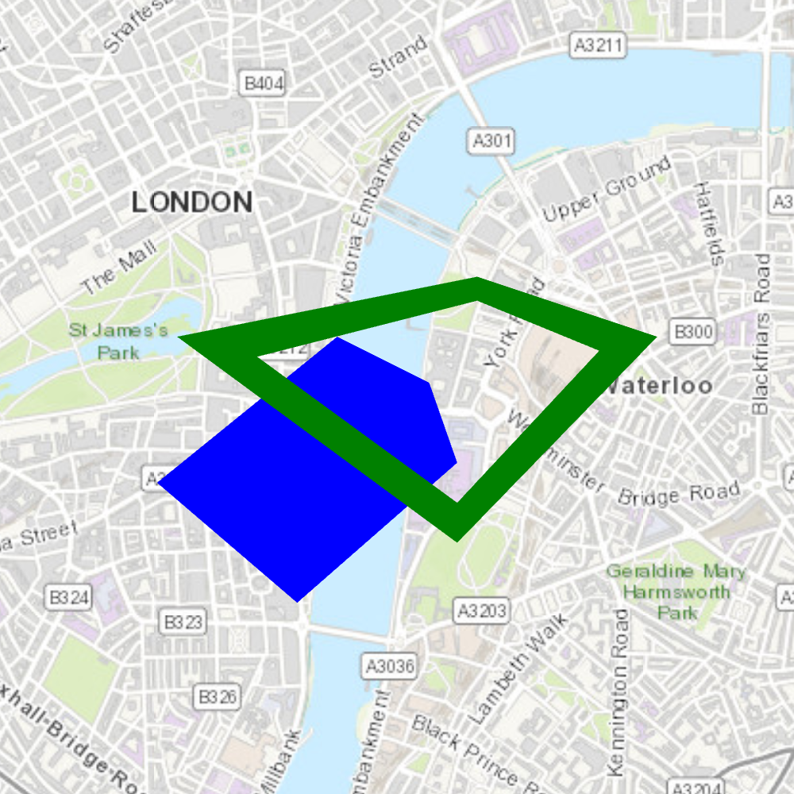

# Spatial operations

The sample provides a drop down on the top, where you can select a geometry operation. When you choose a geometry operation, the application performs this operation between the overlapping polygons and applies the result to the geometries.

## How it works
The sample creates two overlapping polygons using the `PolygonBuilder` class and adds them as graphics to a `GraphicsOverlay`. These polygons are used for performing all the spatial operations. For each operation, a method on the `GeometryEngine` is called with the two polygons as input. The resulting geometry is added as a red colored graphic to the overlay. The methods used are as follows:

- `GeometryEngine::union` - This method returns the two geometries unioned together as one geometry.
- `GeometryEngine::difference` - This method returns any part of Geometry2 that does not intersect Geometry1.
- `GeometryEngine::symmetricDifference` - This method returns any part of Geometry1 or Geometry2 which do not intersect.
- `GeometryEngine::intersection` - This method returns the intersection of Geometry1 and Geometry2.

## Features
- GeometryEngine
- Geometry
- Graphic
- GraphicsOverlay
- PolygonBuilder
