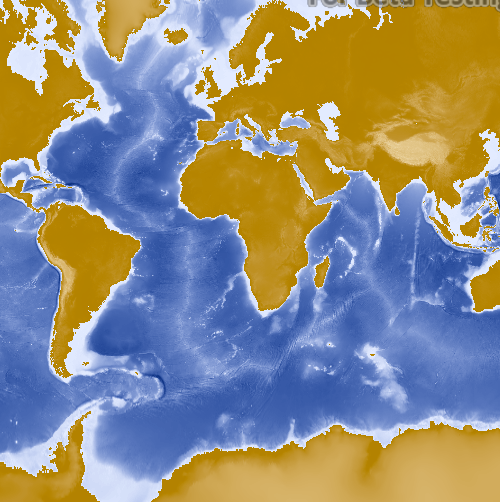

# ArcGIS map image layer (URL)

This sample demonstrates how to display a map image layer.

## How it works

This sample constructs an `ArcGISMapImageLayer` by passing in a URL to the REST endpoint of the map service. The map image layer is then added to a `Basemap`, and the basemap is added to the `Map`.

## Features
- MapView
- Map
- Basemap
- ArcGISMapImageLayer