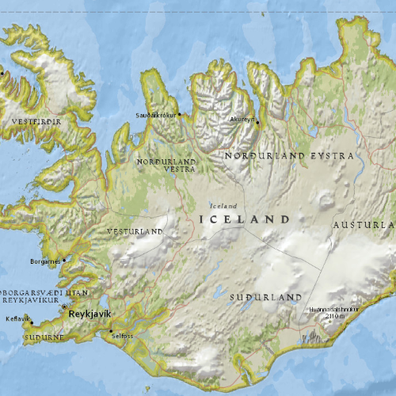

# ArcGIS tiled layer (URL)

This sample demonstrates how to display a tiled map service.

## How it works

An `ArcGISTiledLayer` is constructed by passing in the URL to the map service endpoint. Next, a `Basemap` is created, and the `ArcGISTiledLayer` is appended to the `baseLayers` of the `Basemap`. Finally, the `Map` is constructed with the `Basemap`, and is set to the `MapView`.

## Features
- MapView
- Map
- Basemap
- ArcGISTiledLayer