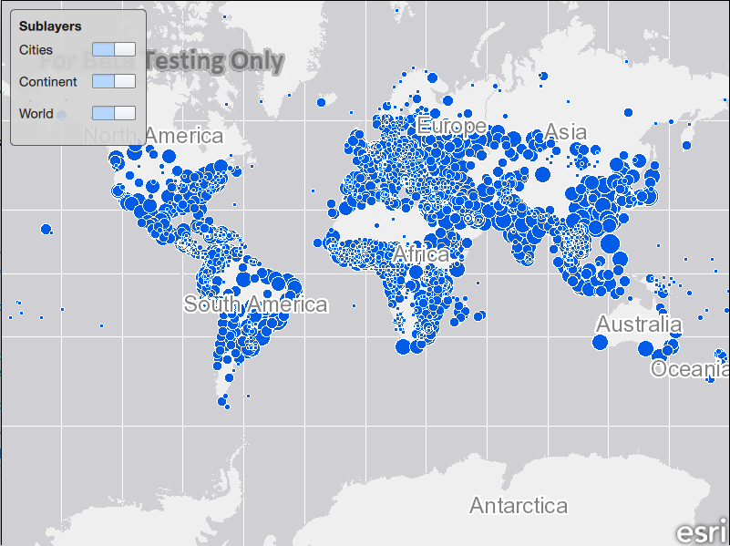

# Change sublayer visibility

This sample demonstrates how you can hide or show sublayers of a map
image layer by using the `ArcGISSublayerListModel`.

## How it works

A list view is used to display the sublayers of the
`ArcGISMapImageLayer`. The list view’s model is set to the
ArcGISMapImageLayer’s `mapImageSublayers` property, which returns an
`ArcGISSublayerListModel`. A delegate is created to display the
sublayers in the list view. The name and visible roles from the list
model are utilized to display the name of the sublayer in the list view,
and to control the visibility of the layer with a QML switch component.
