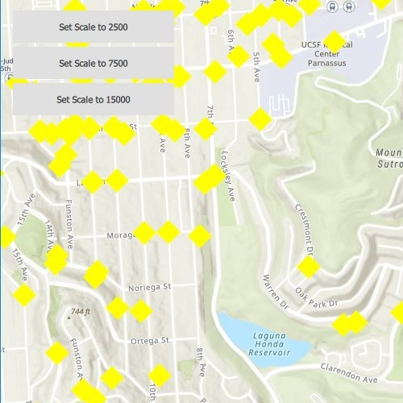

# Class Breaks With Alternate Symbols

This sample demonstrates how to create a class breaks renderer with alternate symbols.

When a layer is symbolized with class break symbology, you can specify the visible scale range for each symbol class. This is an effective strategy to limit the amount of detailed data at smaller scales without having to make multiple versions of the layer, each with a unique definition query.

Once scale ranges are applied to symbol classes, you can further refine the appearance of features within those scale ranges by establishing alternate symbols to different parts of the symbol class scale range.

## How to use the sample
From the UI, select one of the predetermined scales (2500m, 7500m or 15000m) to view the point symbology at that scale in different colors and geometries which is dependent on the scale. In addition to using the predetermined buttons, users also have the ability to manually zoom in an out of the map to see alternate symbols in action dynamically.

## How it works
This sample uses a class breaks renderer that is created with a class break that has a list of alternate symbols and reference properties to specify at which scales each symbol should appear. Once a class breaks renderer with alternate sybmols is created, it is assigned as the renderer of the feature layer.

1. Create a feature layer using the service url and add it to the list of operational layers
2. Create 2 alternate symbols (a blue square and a yellow diamond) to be used for the class break. To create an alternate symbol:
    a. Create a symbol using `SimpleMarkerSymbol` and set the size to 30px
    b. Convert the Simple Marker Symbol to a Multilayer Symbol
    c. Set the reference properties on the multilayer point symbol blue square to (10000, 5000) and on the yellow diamond to (20000, 10000) by calling `multilayer_sym->setReferenceProperties(new SymbolReferenceProperties(20000, 10000, this));`
3. Create a third multilayer symbol to be used when creating the class break:
    a. Create a red triangle and set the reference properties to (5000, 0)
4. Create a class break using the red triangle from step 3 and the list of alternate symbols from step 2
5. Create a class breaks renderer and add the class break from step 4 to it
6. Create a purple diamond simple marker and convert it to a multilayer symbol to be used as the default symbol
7. Set the default symbol on the class breaks renderer to the purple diamond from step 6
8. Set the MinValue on the class breaks renderer to 0
9. Set the fieldName on the class breaks renderer to "status"
10. Assign this class breaks renderer as the renderer on the feature layer from step 1

## Relevant API
 * ClassBreaksRenderer
 * ClassBreaksRenderer.ClassBreak
 * SymbolReferenceProperties
 * SimpleMarkerSymbol

## Additional information
A standard level license is required to ...

## Tags
alternate symbols, class breaks, class breaks renderer, scale based rendering

