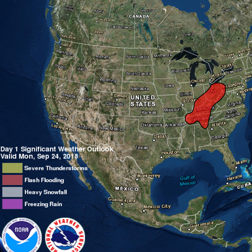

# Display KML

Load and display KML files from various sources, including URLs, local files, and Portal items.

## How to use the sample
Use the UI to select a source. A KML file from that source will be loaded and displayed in the map.

## Relevant API
 - KmlLayer
 - KmlDataset

## Offline data
Read more about how to set up the sample's offline data [here](http://links.esri.com/ArcGISRuntimeQtSamples).

Link | Local Location
---------|-------|
|[US State Capitals](https://www.arcgis.com/home/item.html?id=324e4742820e46cfbe5029ff2c32cb1f)| `<userhome>`/ArcGIS/Runtime/Data/kml/US_State_Capitals.kml |

## About the data
This sample displays three different KML files:

- From URL - this is a map of the significant weather outlook produced by NOAA/NWS. It uses KML network links to always show the latest data.
- From local file - this is a map of U.S. state capitals. It doesn't define an icon, so the default pushpin is used for the points.
- From portal item - this is a map of U.S. states.

## Tags
KML, KMZ, OGC, Keyhole
