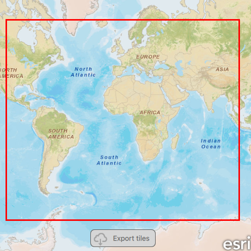

# Export tiles

Download tiles to a local tile cache file stored on the device.

## Use case

Field workers with limited network connectivity can use exported tiles as a basemap for use offline.

## How to use the sample

Pan and zoom into the desired area, making sure the area is within the red boundary. Click 'Export tiles' to start the process. On successful completion you will see a preview of the downloaded tile package.

## How it works

Pan and zoom into the desired area, making sure the area you want to take offline is within the red rectangle. Tap on the `Export tiles` button, and this will obtain the default parameters and call `exportTileCacheWithParameters`, which will return a job. The job must be started manually, and once started can be canceled at anytime. Once the job completes successfully, the output tile cache is added as an `ArcGISTiledLayer` to the map.

## Relevant API

* ArcGISTiledLayer
* ExportTileCacheJob
* ExportTileCacheParameters
* ExportTileCacheTask
* TileCache

## Additional information

ArcGIS tiled layers do not support reprojection, query, select, identify, or editing. See the [Layer types](https://developers.arcgis.com/qt/layers/#layer-types) discussion in the developers guide to learn more about the characteristics of ArcGIS tiled layers.

## Tags

cache, download, offline
