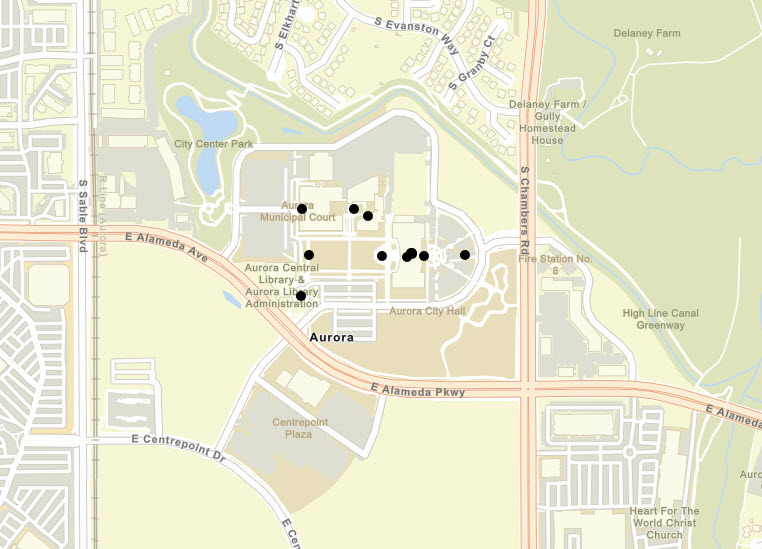

# Feature layer (shapefile)

Open a shapefile stored on the device and display it as a feature layer with default symbology.

## Use case

Shapefiles store location, shape and attributes of geospatial vector data. Shapefiles can be loaded directly into ArcGIS Runtime.

## How to use the sample

Pan and zoom around the map. View the data loaded from the shapefile.

## How it works

1. Create a `ShapefileFeatureTable` passing in the URL of a shapefile.
2. Create a `FeatureLayer` using the shapefile feature table.
3. Add the layer to the map's operation layers.

## Relevant API

* FeatureLayer
* ShapefileFeatureTable

## Offline data

Read more about how to set up the sample's offline data [here](http://links.esri.com/ArcGISRuntimeQtSamples#use-offline-data-in-the-samples).

Link | Local Location
---------|-------|
|[Public Art Shapefile](https://www.arcgis.com/home/item.html?id=d98b3e5293834c5f852f13c569930caa)| `<sdcard>`/ArcGIS/Samples/ShapeFile/Aurora_CO_shp/Public_Art.shp|

## Tags

Layers, shapefile, shp, vector
