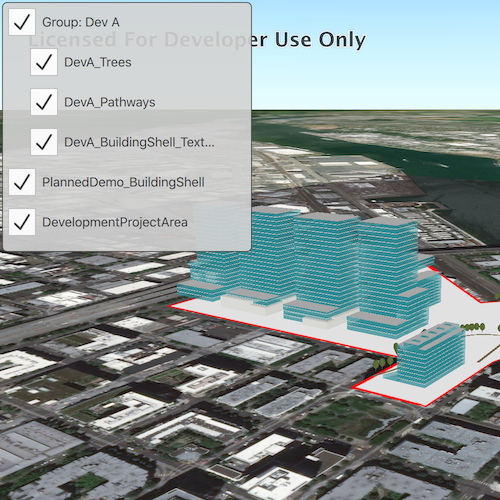

# Group layers

Group a collection of layers together and toggle their visibility as a group.

## Use case

Group layers communicate to the user that layers are related and can be managed together.

In a land development project, you might group layers according to the phase of development.

## How to use the sample

The layers in the map will be displayed in a table of contents. Toggle the checkbox next to a layer's name to change its visibility. Turning a group layer's visibility off will override the visibility of its child layers.

## How it works

1. Create an empty `GroupLayer`.
2. Create a new layer and add it to the group layer's layers collection.
3. To build the table of contents:
4. Create a ListView and bind the model the the scene's operational layer list model.
5. Create a delegate for the group layer and and another delegate for all other layers. The group layer delegate will have nested checkboxes.
6. Check that the layer is a group layer. If true, load the group layer delegate. If false, load the other delegate.
7. Each delegate will use the `name` and `layerVisible` roles exposed on the `LayerListModel`.
8. To toggle the visibility of the group, simply change the group layer's visibility property.

## Relevant API

* GroupLayer

## Additional information

The full extent of a group layer may change when child layers are added/removed. Group layers do not have a spatial reference, but the full extent will have the spatial reference of the first child layer.

## Tags

Layers, group layer, LayerListModel, GroupLayer
