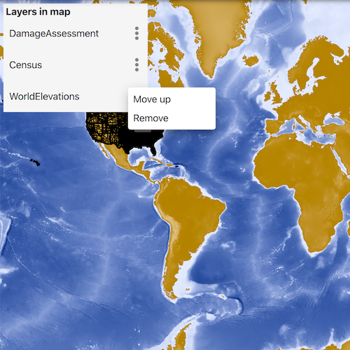

# Manage operational layers

Add, remove, and reorder operational layers in a map.

## Use case

Operational layers display the primary content of the map and usually provide dynamic content for the user to interact with (as opposed to basemap layers that provide context).

The order of operational layers in a map determines the visual hierarchy of layers in the view. You can bring attention to a specific layer by rendering above other layers.

## How to use the sample

When the app starts, a list displays the operational layers that are currently displayed in the map. Select the menu option on the list item to remove or reorder the layer. The map will be updated automatically.

The second list shows layers that have been removed from the map. Select the menu option on the list item to add it to the map.

## How it works

1. Get the operational layers `LayerListModel` from the map using `Map::operationalLayers`.
2. Add or remove layers using `operationalLayers()->append(layer)` and `operationalLayers()->remove(layer)` respectively. The last layer in the list will be rendered on top.

## Relevant API

* Map
* ArcGISMapImageLayer
* LayerListModel
* LayerListModel::append
* LayerListModel::move
* LayerListModel::removeAt

## Tags

add, delete, layer, map, remove
