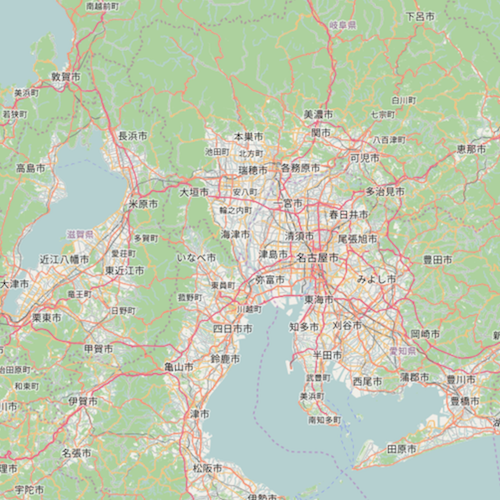

# OpenStreetMap layer

This sample demonstrates how to add the OpenStreetMap layer to a map as a Basemap.

## How it works
The `Basemap::openStreetMap()` static function is used to create a `Basemap` with an `OpenStreetMapLayer` as the baseLayer of the basemap. The returned basemap is used to instantiate a `Map`. The attribution text that is required by OpenStreetMap is automatically added to the `MapView's` attributionText without any additional code.

## Features
- `OpenStreetMapLayer`
- `Basemap`
- `Map`
- `MapView`
