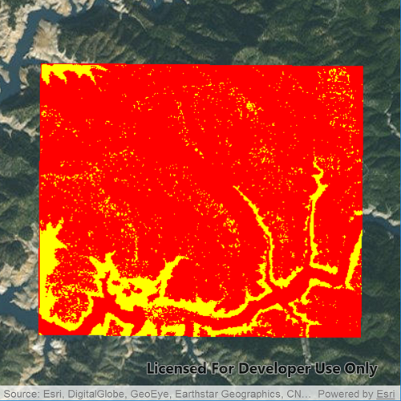

# Colormap renderer

Demonstrates how to use a colormap renderer on raster layer. Colormap
renderers can be used to replace values on a raster layer with a color
based on the original brightness value.

## How it works

To apply a `ColormapRenderer` to a `RasterLayer`:

  - Create a `Raster` from a raster file.
  - Create a `RasterLayer` from the raster.
  - Create a `QList<QColor>`: colors at the beginning of the list
    replace the darkest values in the raster and colors at the end of
    the list replaced the brightest values of the raster.
  - Create a colormap renderer with the color list and apply it to the
    raster layer with `RasterLayer::setRenderer(RasterRenderer
    *renderer)`.

## Offline Data

Read more about how to set up the sample’s offline data
[here](http://links.esri.com/ArcGISRuntimeQtSamples).

| Link                                                                                             | Local Location                                       |
| ------------------------------------------------------------------------------------------------ | ---------------------------------------------------- |
| [ShastaBW.tif raster](https://www.arcgis.com/home/item.html?id=cc68728b5904403ba637e1f1cd2995ae) | `<userhome>`/ArcGIS/Runtime/Data/raster/ShastaBW.tif |
