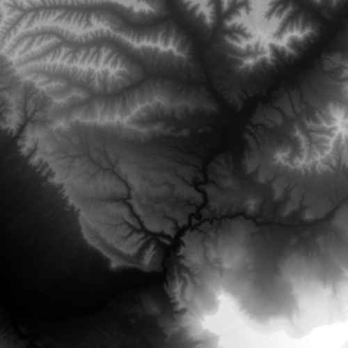

# Raster layer (file)

Demonstrates how to create and use a raster layer made from a local
raster file.

## How to use the sample

  - The sample will load with a map showing a basemap and a loaded
    raster layer.
  - Tap on the “Add Raster” button to browse for a new raster file.
  - On desktop platforms the sample also allows you to drag and drop
    supported raster files to load.

## How it works

To add a `RasterLayer` as an operational layer from a local raster file:

  - Create a `Map` with a `Basemap`. Once this has been loaded, raster
    layers will be re-projected on the fly to match the map.
  - Create a `Raster` from a raster file.
  - Create a `RasterLayer` from the raster.
  - Add it as an operational layer with
    `m_map->operationalLayers->append(rasterLayer)`.
  - Once the raster layer has been successfully loaded, zoom the map
    view to an appropriate extent to see it.

## Offline Data

Read more about how to set up the sample’s offline data
[here](http://links.esri.com/ArcGISRuntimeQtSamples).

| Link                                                                                           | Local Location                                     |
| ---------------------------------------------------------------------------------------------- | -------------------------------------------------- |
| [Shasta.tif raster](https://www.arcgis.com/home/item.html?id=c669445e6cb4490b8306f0c170a9cbb1) | `<userhome>`/ArcGIS/Runtime/Data/raster/Shasta.tif |
