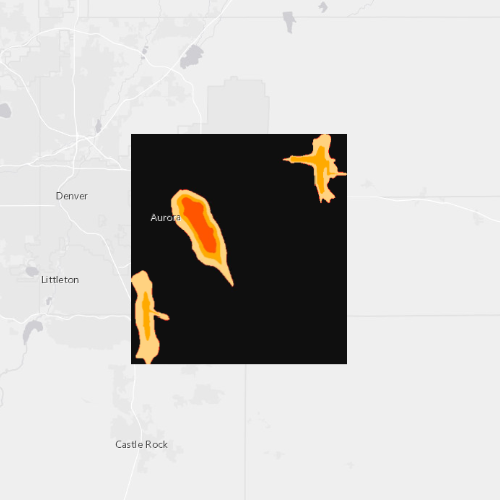

# Raster layer (GeoPackage)

This sample demonstrates how to open a GeoPackage, obtain a raster from
the package, and display the table as a RasterLayer.

## How it works

A GeoPackage is created by passing the path to a `.gpkg` file. Once the
`Map` loads, `GeoPackage::load` is called. A signal handler is connected
so that once the `GeoPackage` loads, the `RasterLayer` can be created.
The `RasterLayer` is created by obtaining the first `Raster` in the list
of `GeoPackageRasters`, and passing that `Raster` to the `RasterLayer`.
Finally, the new layer is appended to the Map’s operational layers.

## Offline Data

Read more about how to set up the sample’s offline data
[here](http://links.esri.com/ArcGISRuntimeQtSamples).

| Link                                                                                                     | Local Location                                      |
| -------------------------------------------------------------------------------------------------------- | --------------------------------------------------- |
| [Aurora, Colorado GeoPackage](https://www.arcgis.com/home/item.html?id=68ec42517cdd439e81b036210483e8e7) | `<userhome>`/ArcGIS/Runtime/Data/gpkg/AuroraCO.gpkg |
