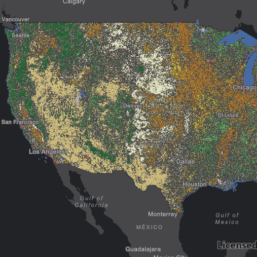

# Raster layer (service)

This sample demonstrates how to create an `ImageServiceRaster` and add it to a raster 
layer. An `ImageServiceRaster` allows you to work with an image map service exposed by the ArcGIS Server Rest API.

## How it works
This is a basic sample of adding an `ImageServiceRaster` to a `RasterLayer`.  When the sample starts, an `ImageServiceRaster` is created and added to a `RasterLayer`.  The `RasterLayer` is then added to the map as a `Basemap`.

## Features
- `Map`
- `MapQuickView`
- `ImageServiceRaster`
- `RasterLayer`
