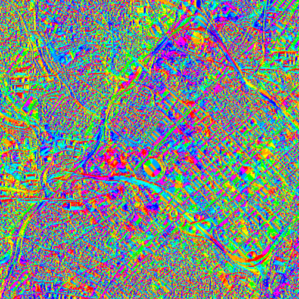

# Raster rendering rule

This sample demonstrates how to create an `ImageServiceRaster`, fetch the `RenderingRules` from the service info, and use a `RenderingRule` to create an `ImageServiceRaster` and add it to a raster layer. 

## How it works
 When the sample starts, an `ImageServiceRaster` is created and added to a `RasterLayer`.  The `RasterLayer` is then added to the map as an operational layer.  Connect to the `doneLoading` signal for the `RasterLayer`. Once the `ImageServiceRaster` is loaded, the `RenderingRuleInfos` are fetched. Iterate over each item in the `RenderingRuleInfos` to get the rendering rule name and populate a data model using the names. This becomes the model for the combo box. When an item from the combo is selected and apply is pressed, the `RenderingRuleInfo` for the selected index is fetched from the service info. A `RenderingRule` object is created using the `RenderingRuleInfo` and applied to a newly created `ImageServiceRaster`. The `ImageServiceRaster` is then added to the `RasterLayer`.   

## Features
- `Map`
- `ImageServiceRaster`
- `RenderingRuleInfo`
- `RenderingRule`
- `RasterLayer`
