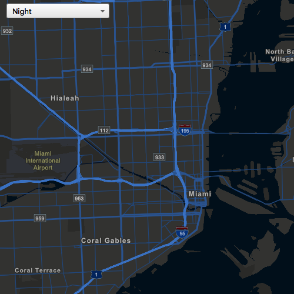

#Change basemap

This sample uses Vector Tiled Layer basemap from an ArcGIS Online service URL. It shows how to creates an ArcGISVectorTiledLayer from an ArcGIS Online service URL and bind that to a  Basemap.

##How it works

When a new item is selected from the combo box, an invokable C++ function that determines the currently selected Vector Tiled Layer basemap is executed. The map's basemap is replaced by simply calling its setBasemap method, and passing in the desired basemap.

##Features
- MapView
- Map
- Basemap
- ArcGISVectorTiledLayer