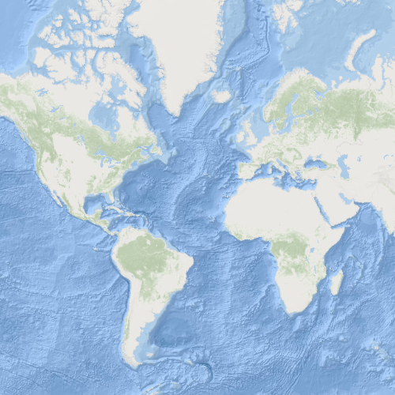

# Web tiled layer

This sample demonstrates how to display map tiles from an online
resource using the WebTiledLayer.

## How it works

WebTiledLayer provides a simple way to integrate non-ArcGIS Services as
a layer in a map. In this case, map tiles from Stamen are added to the
map. The template URL is specified by setting the subDomains, level,
col, and row attributes. Additionally, copyright information is added to
the layer so that the layer can be properly attributed. The layer is
added to a Basemap, and a Basemap is added to a Map. Finally, the Map is
set on the MapView, and the tiled layer is displayed.

## Features

WebTiledLayer Basemap Map MapView
