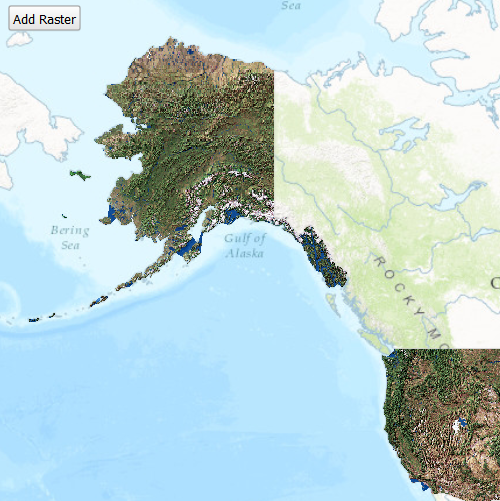

# Dynamic workspace raster

This sample demonstrates how to dynamically add a local raster file to a
map using the Local Server.

## How it works

A `LocalMapService` is created using a blank MPK. Next, a
`RasterWorkspace` is created for the selected folder, and a
`RasterSublayerSource` is created from the raster workspace and the file
name. Then, the raster workspace is added to the local service’s dynamic
workspaces, by calling `setDynamicWorkspaces`. Once the workspaces are
set, the local map service is started. Once the service starts
successfully, an `ArcGISMapImageSublayer` is created from the
`RasterSublayerSource`, the sublayer is added to a new
`ArcGISMapImageLayer`, and the image layer is added to the `Map`.

## Offline Data

Read more about how to set up the sample’s offline data
[here](http://links.esri.com/ArcGISRuntimeQtSamples).

| Link                                                                                           | Local Location                                          |
| ---------------------------------------------------------------------------------------------- | ------------------------------------------------------- |
| [Blank map package](https://www.arcgis.com/home/item.html?id=ea619b4f0f8f4d108c5b87e90c1b5be0) | `<userhome>`/ArcGIS/Runtime/Data/mpk/mpk\_blank.mpk     |
| [USA Raster](https://www.arcgis.com/home/item.html?id=80b43ba48f524a8eb0cb54f0f1ee9a5f)        | `<userhome>`/ArcGIS/Runtime/Data/raster/usa\_raster.tif |
