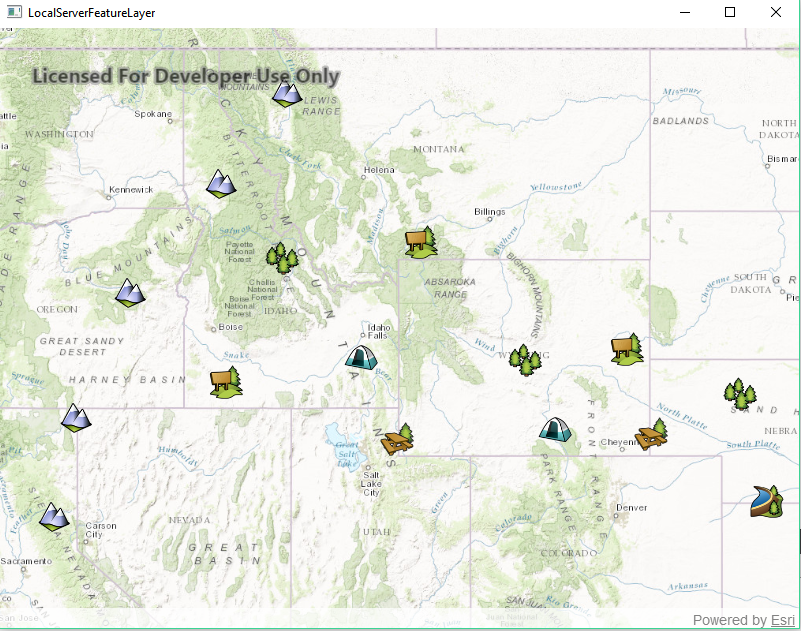

# Local Server feature layer

Start a local feature service and display its features in a map.

## Use case

For executing offline geoprocessing tasks in your ArcGIS Runtime apps via an offline (local) server.

## How to use the sample

A Local Server and Local Feature Service will automatically be started. Once started then a `FeatureLayer` will be created and added to the map.

## How it works

1. Create and run the Local Server.
    * `LocalServer::instance` creates the Local Server.
    * `LocalServer::start()` starts the server asynchronously.
2. Wait for server to be in the `LocalServerStatus::Started` state.
    * `LocalServer::statusChanged()` fires whenever the running status of the Local Server changes.
3. Create and run a local service. For example, to run a `LocalMapService`:
    * `new LocalFeatureService(Url)` creates a local feature service with the given URL path to the map package (`mpk` file).
    * `LocalFeatureService::start()` starts the service asynchronously.
    * The service is added to the Local Server automatically.
4. Wait for feature service to be in the `LocalServerStatus::Started` state.
    * `LocalFeatureService::statusChanged()` signal fires whenever the status of the Local Service changes.
5. Create a feature layer from local feature service.
    * Create a `ServiceFeatureTable(Url)` from local feature service URL, `LocalFeatureService::url()`.
	* Create a `FeatureLayer` using the service feature table.
	* Add the feature layer to the map's operational layers.
	* Connect to the feature layer's `LoadStatusChanged` signal.
	* When the feature layer's status is `Loaded`, set the map view's extent to the layer's full extent.

## Relevant API

* FeatureLayer
* LocalFeatureService
* LocalFeatureService::statusChanged
* LocalServer
* LocalServerStatus

## Offline Data

Read more about how to set up the sample's offline data [here](http://links.esri.com/ArcGISRuntimeQtSamples#use-offline-data-in-the-samples).

Link | Local Location
---------|-------|
|[PointsOfInterest map package](https://www.arcgis.com/home/item.html?id=4e94fec734434d1288e6ebe36c3c461f)| `<userhome>`/ArcGIS/Runtime/Data/mpk/PointsofInterest.mpk |

## Additional information

Local Server can be downloaded for Windows and Linux platforms. Local Server is not supported on **macOS**.

## Tags

feature service, local, offline, server, service
