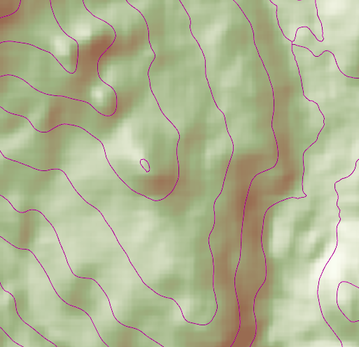

# Local Server geoprocessing

Demonstrates how to create contour lines from local raster data using a local geoprocessing package (.gpk) and the contour geoprocessing tool.

**Note:** Local Server is not supported on macOS.

## How to use the sample

Contour Line Controls (Top Left):

 * Interval-- Specifies the spacing between contour lines.
 * Generate Contours -- Adds contour lines to map using interval.
 * Clear Results -- Removes contour lines from map.

## How it works

To create a `FeatureLayer` from a `LocalFeatureService`:

1. Add raster data to map using as an `ArcGISTiledLayer`.
2. Create and run the Local Server.
    * `LocalServer::instance` creates the Local Server.
    * `LocalServer::start()` starts the server asynchronously.
3. Wait for server to be in the `LocalServerStatus::STARTED` state.
    * `LocalServer::statusChanged()` fires whenever the running status of the Local Server changes.
4. Start a `LocalGeoprocessingService` and run a `GeoprocessingTask`
    * `new LocalGeoprocessingService(Url, ServiceType)`, creates a local geoprocessing service
    * `LocalGeoprocessingService::start()` starts the service asynchronously.
    * `new GeoprocessingTask(LocalGeoprocessingService.url() + "/Contour")`, creates a geoprocessing task that uses the contour lines tool
5. Create `GeoprocessingParameters` and add a `GeoprocessingDouble` as a parameter using set interval.
    * `new GeoprocessingParameters(ExecutionType)`, creates geoprocessing parameters
    * `inputs.insert("ContourInterval", new GeoprocessingDouble(double))`, creates a parameter with name `ContourInterval` with the interval set as its value.
    * `gpParams.setInputs(inputs)`, sets the input with the interval value.
6. Create and start a `GeoprocessingJob` using the parameters from above.
    * `GeoprocessingTask::createJob(GeoprocessingParameters)`, creates a geoprocessing job
	* `GeoprocessingJob::start()`, starts the job.
7. Add contour lines as an `ArcGISMapImageLayer` to map.
    * Get url from local geoprocessing service, `LocalGeoprocessingService::url()`
    * Get server job id of geoprocessing job, `GeoprocessingJob::serverJobId()`
    * Replace `GPServer` from url with `MapServer/jobs/jobId`, to get generate contour lines data
    * create a map image layer from that new url and add that layer to the map

## Features

* GeoprocessingDouble
* GeoprocessingJob
* GeoprocessingParameter
* GeoprocessingParameters
* GeoprocessingTask
* LocalGeoprocessingService
* LocalGeoprocessingService.ServiceType
* LocalServer
* LocalServerStatus

## Offline Data
Read more about how to set up the sample's offline data [here](http://links.esri.com/ArcGISRuntimeQtSamples).

Link | Local Location
---------|-------|
|[Contour geoprocessing package](https://www.arcgis.com/home/item.html?id=da9e565a52ca41c1937cff1a01017068)| `<userhome>`/ArcGIS/Runtime/Data/gpk/Contour.gpk |
|[Raster Hillshade TPK](https://www.arcgis.com/home/item.html?id=f7c7b4a30fb9415896ba0d1921fe014b)| `<userhome>`/ArcGIS/Runtime/Data/tpk/RasterHillshade.tpk |

