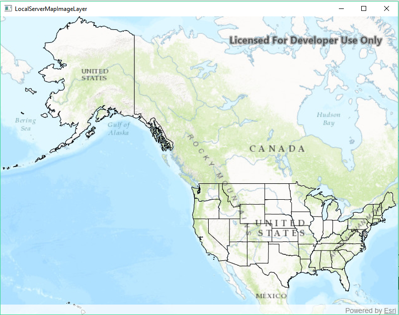

# Local Server Map Image Layer

Demonstrates how to start the Local Server and Local Map Service, then create an ArcGIS Map Image Layer from the Local Map Service and add it to a map.

**Note:** Local Server is not supported on MacOS

## How to use the sample

The Local Server and Local Map Service will automatically be started and once running an ArcGIS Map Image Layer will be created and added to the map.

## How it works

To create a `ArcGISMapImageLayer` from a `LocalMapService`:

1. Create and run the local server.
    * `LocalServer::instance` creates the local server
    * `LocalServer::start()` starts the server asynchronously
2. Wait for server to be in the  `LocalServerStatus::STARTED` state.
    * `LocalServer::statusChanged()` fires whenever the running status of the local server has changed.
3. Create and run a local service, example of running a `LocalMapService`.
    * `new LocalMapService(Url)`, creates a local map service with the given url path to mpk file
    * `LocalMapService::start()`, starts the service asynchronously
    * service will be added to the local server automatically
4. Wait for map service to be in the LocalServerStatus::STARTED state.
    * `LocalMapService::statusChanged()` signal fires whenever the status of the local service has changed.
5. Create an arcgis map image layer from local map service.
    * create a `ArcGISMapImageLayer(Url)` from local map service url, `LocalMapService::url()`
	* add the layer to the map's operational layer
	* connect to the map image layer's `LoadStatusChanged` signal
	* once the status is `Loaded`, set the mapview's extent to the layer's full extent.

## Features
* ArcGISMapImageLayer
* LocalMapService
* LocalServer
* LocalServerStatus
