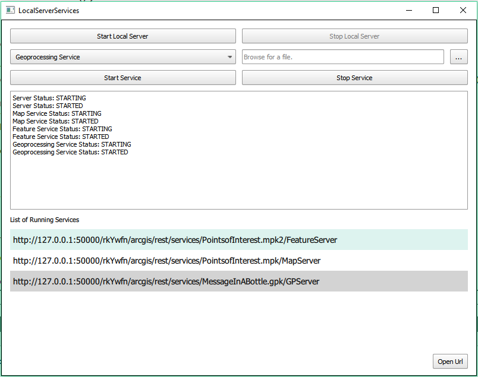

# Local server services

Demonstrates how to start and stop the Local Server and start and stop a local map, feature, and geoprocessing service running on the Local Server.

## Use case

For executing offline geoprocessing tasks in your ArcGIS Runtime apps via an offline (local) server.

## How to use the sample

Click `Start Local Server` to start the Local Server. Click `Stop Local Server` to stop the Local Server.

The `Map Service` combo box lets you to pick a local service that is available.

After browsing for the desired file, click `Start Service` to start the selected service.

When the running service's url appears, select it and click `Open Url`. To stop this running service, click `Stop Service`.

## How it works

1. Create it with `LocalServer::instance` and use `LocalServer::start()` to start the server asynchronously.
2. `LocalServer::statusChanged()` fires whenever the running status of the Local Server changes. Wait for the server to be in the `LocalServerStatus::Started` state.
3. Create and run a local service. Here is an example of running a `LocalMapService`:
    * `new LocalMapService(Url)` creates a local map service with the given URL path to map package (`mpk` or `mpkx` file).
    * `LocalMapService::start()` starts the service asynchronously.
    * The service is added to the `LocalServer` automatically.

To stop a `LocalServer` and stop any `LocalServices` that are added to it:

1. Get any services that are currently running on the local server with `LocalServer::services()`.
2. Loop through all services and stop the selected service (from the dropdown) if it is started.
3. Use `LocalService::status()` to check if the service's status is `LocalServerStatus::Started`.
4. `LocalService::stop()` stops the service asynchronously.
5. `LocalService::statusChanged()` fires whenever the running status of the local service has changed. Wait for all services to be in the `LocalServerStatus::Stopped` state.
6. Stop the local server with `LocalServer::stop()`.

## Relevant API

* LocalFeatureService
* LocalGeoprocessingService
* LocalMapService
* LocalServer
* LocalServerStatus
* LocalService

## Offline Data

Read more about how to set up the sample's offline data [here](http://links.esri.com/ArcGISRuntimeQtSamples#use-offline-data-in-the-samples).

Link | Local Location
---------|-------|
|[PointsOfInterest map package](https://www.arcgis.com/home/item.html?id=4e94fec734434d1288e6ebe36c3c461f)| `<userhome>`/ArcGIS/Runtime/Data/mpk/PointsofInterest.mpk |
|[MessageInABottle geoprocessing package](https://www.arcgis.com/home/item.html?id=a0ef1f20344f43ad8837f0e0d8406d03)| `<userhome>`/ArcGIS/Runtime/Data/mpk/MessageInABottle.gpk |

## Additional information

Local Server can be downloaded for Windows and Linux platforms. Local Server is not supported on **macOS**.

## Tags

feature, geoprocessing, local services, map, server, service
