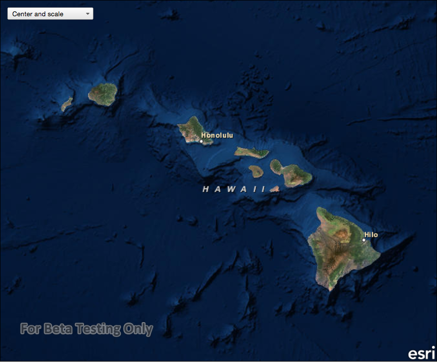

# Change viewpoint

Set the map view to a new viewpoint.

## Use case

Programatically navigate to a specified location in the map or scene. Use this to focus on a particular point or area of interest.

## How to use the sample

The map view has several methods for setting its current viewpoint. Select a viewpoint from the UI to see the viewpoint changed using that method.

## How it works

1. Create a new `Map` object and set it to the `MapView` object.
2. Change the map's `Viewpoint` using one of the available methods:
  * Use `MapView::setViewpointAsync(viewPoint, duration, AnimationCurve)` to pan to a viewpoint over the specified length of time.
  * Use `MapView::setViewpointCenterAsync()` to center the viewpoint on a `Point` and set a distance from the ground using a scale.
  * Use `MapView::setViewpointGeometryAsync()` to set the viewpoint to a given `Geometry` 
  * Use `MapView::setViewpointRotationAsync()` to set the viewpoint to a given degree.
  * Use `MapView::setViewpointScaleAsync()` to set the viewpoint to a given scale.

## Relevant API

* AnimationCurve
* Map
* Geometry
* MapView
* Point
* Viewpoint

## Additional information

Below are some other ways to set a viewpoint:

* GeoView::setViewpointAsync

## Tags

animate, extent, pan, rotate, scale, view, zoom
