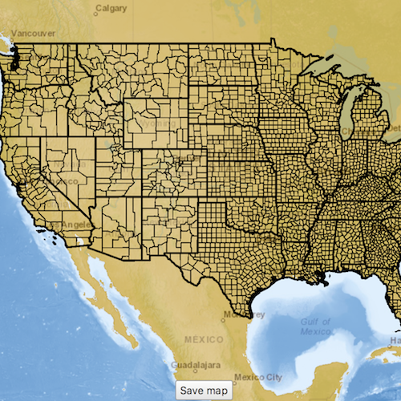

# Create and save map

This sample demonstrates how to author a `Map` in ArcGIS Runtime and save it to ArcGIS Online as a web map.

## How to use the sample
- Select the basemap and operational layers to include in the `Map`.
- Press the save button to save the `Map`.
- Sign in to ArcGIS Online with a valid organizational account.
- Give the `Map` a title, and optionally give it a description and some tags.
- Press the save button to save the `Map` to ArcGIS Online with the provided information.

## How it works
- A `Map` is created with the user options and added to a `MapView`.
- A `Portal` object is created by setting the URL to `https://www.arcgis.com` and setting `loginRequired` to true.
- Once the Save button is pressed, the `Portal` load cycle is started, which will trigger an `AuthenticationChallenge`.
- User credentials are gathered and passed into the `AuthenticationManager` via the Toolkit's `AuthenticationView`.
- Title, tags, and description strings are gathered, and `Map::saveAs` is executed.

## Relevant API
 - Map
 - Portal
 - Map::saveAs()

## Tags
Author Map, Save Map, Web Map, Create Map
