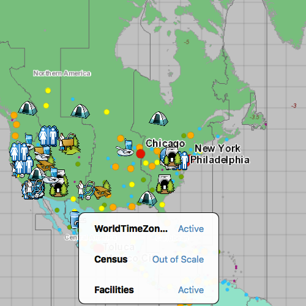

# Display layer view draw state

This sample demonstrates how to get the view state of a `Layer` in a `Map`.

## How it works
`MapQuickView` has a signal called `layerViewStateChanged` that gets emitted every time a layer's view status changes. The signal contains two arguments, layer, the `Layer` whose state changed, and layerViewState, the `LayerViewState` object defining the new state. 

## Features
- MapView
- Map
- Basemap
- ArcGISMapImageLayer
- ArcGISTiledLayer
- ServiceFeatureTable
- FeatureLayer
- LayerViewState
- Viewpoint
- SpatialReference

