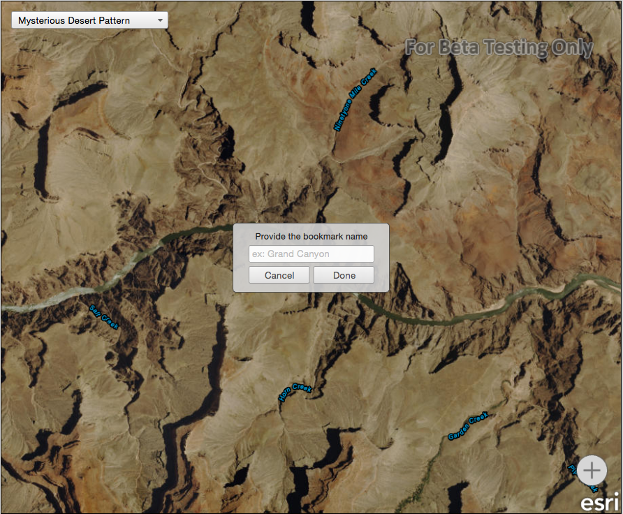

# Manage bookmarks

This sample demonstrates how to access and add bookmarks to a map.

## How it works

When the sample starts, the map contains a set of bookmarks. You can select a bookmark from the list, which changes the map's viewpoint. To create a new bookmark, pan and zoom to a new location and select the `+` button. A prompt appears to let you provide a name for the new bookmark. When you select `Done` the new bookmark is added to the bookmark list.

## Features
- MapView
- Map
- Basemap
- Viewpoint
- Bookmark
- Envelope
- SpatialReference
